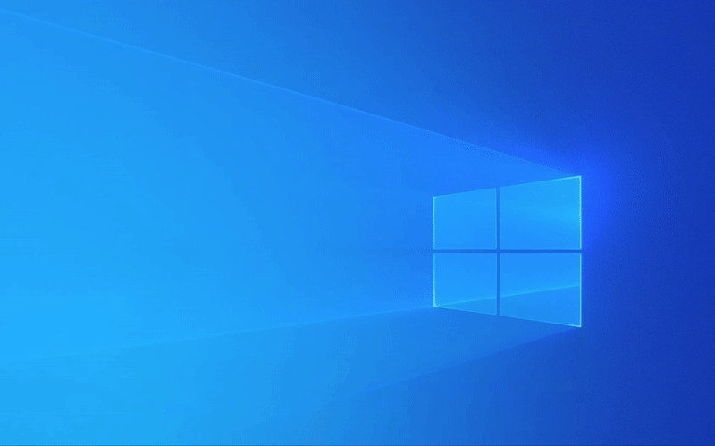

# overlays

A Windows overlay server with a Python client library. The published `overlays` wheel bundles the
Rust `overlays-server.exe`, so users can start the server directly from the installed package.



## Install And Run

- Windows 10 or later
- Python 3.10+ for the packaged launcher and client library

Run the packaged server without installing anything permanently:

```powershell
uvx overlays
```

After installing the package, either entry point starts the bundled server in the foreground:

```powershell
overlays
overlays-server
```

Set `OVERLAY_PIPE_NAME` if you want a different named pipe:

```powershell
$env:OVERLAY_PIPE_NAME="overlay_manager_env"
uvx overlays
```

The server listens on `\\.\pipe\{OVERLAY_PIPE_NAME}` and defaults to
`\\.\pipe\overlay_manager`.

## Standalone Binary

GitHub Releases also publish a portable Windows zip named
`overlays-server-v<version>-windows-x64.zip`. It contains:

- `overlays-server.exe`
- `README.txt`
- `SHA256SUMS.txt`

## Use The Python Client

```python
from overlays.client import OverlayClient

overlay = OverlayClient()

overlay.create_highlight_window(rect=(100, 100, 400, 300), timeout_seconds=5)
overlay.create_countdown_window(message_text="Get ready!", countdown_seconds=10)
overlay.create_elapsed_time_window(message_text="Session Length")
overlay.create_qrcode_window(
    data={"url": "https://example.com"},
    duration=15,
    caption="Scan me",
)
overlay.update_window_message(window_id=2, new_message="Halfway there...")
overlay.close_window(window_id=1)
overlay.take_break(duration_seconds=60)
overlay.cancel_break()
```

## Development

Development requires Rust stable in addition to Python.

Install Python dependencies:

```bash
uv sync --dev
```

Run the Rust server from source:

```bash
cargo run --manifest-path rust/overlays-server/Cargo.toml
```

Build and test the Rust server:

```bash
cargo build --manifest-path rust/overlays-server/Cargo.toml
cargo test --manifest-path rust/overlays-server/Cargo.toml
```

Run the Python tests, including client compatibility checks against the built Rust binary:

```bash
uv run pytest -v
```

If the compatibility tests need an explicit server executable path, set `OVERLAYS_SERVER_BIN`.

## IPC Commands

| Command | Args | Description |
| --- | --- | --- |
| `create_highlight_window` | `rect: (l, t, r, b)`, `timeout_seconds: int` | Shows a colored rectangle for a duration. |
| `create_countdown_window` | `message_text: str`, `countdown_seconds: int` | Starts a countdown timer. |
| `create_elapsed_time_window` | `message_text: str` | Displays elapsed time since creation. |
| `create_qrcode_window` | `data: str \| dict`, `duration: int`, `caption: str` | Renders a QR code overlay. |
| `update_window_message` | `window_id: int`, `new_message: str` | Changes the text of a countdown or elapsed-time window. |
| `close_window` | `window_id: int` | Closes any overlay window. |
| `take_break` | `duration_seconds: int` | Discards incoming non-break commands for a break period. |
| `cancel_break` | *(none)* | Cancels any active break. |
